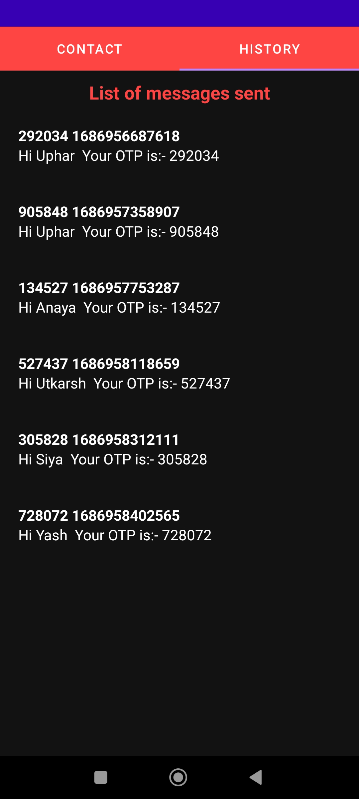

# Contactapp
BUILD A SIMPLE CONTACTS APP (WITH OTP SMS SENDING FUNCTIONALITY)
 
# Contactapp
BUILD A SIMPLE CONTACTS APP (WITH OTP SMS SENDING FUNCTIONALITY)

# OTP Sending App

This is an Android application that allows users to send OTP (One-Time Password) messages using Twilio API. Users can enter contact information, generate OTP, and send it via SMS. The app also stores the sent OTP messages in a local Room database for later retrieval.

## Features

- Enter contact information (first name, last name, and mobile number).
- Generate OTP (random 6-digit number) for each contact.
- Send OTP via SMS using Twilio API.
- Store sent OTP messages in a local Room database.
- Retrieve and display the list of sent OTP messages.

## Screenshots

  
  

## Installation

1. Clone the repository to your local machine.
2. Open the project in Android Studio.
3. Build and run the app on an emulator or a physical device.

## Usage

1. Launch the app on your Android device.
2. Enter the contact information (first name, last name, and mobile number).
3. Tap the "Generate OTP" button to generate a random 6-digit OTP.
4. The generated OTP will be displayed in the message input field.
5. Tap the "Send" button to send the OTP via SMS using Twilio API.
6. If the OTP is sent successfully, it will be saved in the local database.
7. The list of sent OTP messages can be accessed by navigating to the "History" section.
8. In the "History" section, all the sent OTP messages will be displayed in a RecyclerView.
9. Tap on a message to view detailed information.
10. Use the tabs at the top to switch between different sections of the app.

## Technologies Used

- Kotlin - Programming language used for app development.
- Android Architecture Components - LiveData, ViewModel, and Room for data management.
- Retrofit - HTTP client for making API requests to Twilio.
- Twilio API - Used for sending SMS messages.
- ViewPager2 - Used for implementing swipeable fragments with a ViewPagerAdapter.
- RecyclerView - Used for displaying the list of sent OTP messages.
- JSON - Used to store contact information as a JSON file.

## Dependencies

- androidx.lifecycle:lifecycle-viewmodel-ktx:2.4.0
- androidx.lifecycle:lifecycle-runtime-ktx:2.4.0
- androidx.room:room-ktx:2.5.1
- androidx.recyclerview:recyclerview:1.2.1
- com.squareup.retrofit2:retrofit:2.9.0
- com.squareup.retrofit2:converter-gson:2.9.0
- com.twilio:twilio-java-sdk:8.20.0

## License

This project is licensed under the MIT License.

## Contact

For any inquiries or collaboration opportunities, please feel free to reach out to me on [LinkedIn](https://www.linkedin.com/in/uphargaur/).
